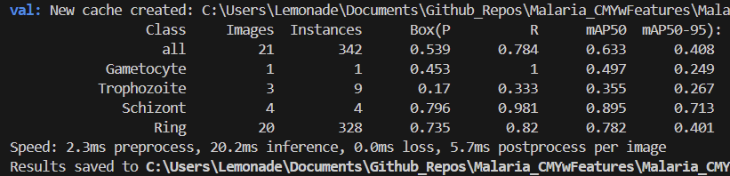

# Malaria CMY with Feature Augmentations

Ultralytics YOLOv11 experiments for automated malaria parasite staging under
different handcrafted feature representations. The repository bundles scripts to
convert the original NIH malaria dataset to YOLO format, multiple feature
variants (CMY, HOG, LBP, ORB combinations), training and evaluation entry points,
and exported validation artefacts.

## Repository Layout
- `Dataset/` – YOLO-ready datasets for *Plasmodium falciparum* (`F_*`) and
  *P. vivax* (`V_*`) under different feature-transformation pipelines
  (CMHOG, CHOGY, CORBY, etc.). Each dataset follows the Ultralytics layout of
  `train|val|test/{images,labels}`.
- `Dataset/malaria/convertToYolo.py` – end-to-end converter from the public
  JSON annotations into a stratified YOLO split for the Vivax subset; helper
  scripts (`*_replace.py`, `CMY.py`) generate additional feature channels.
- `YoloConfig/<Species>/<Token>.yaml` – data configuration files pointing the
  trainer to a specific dataset variant.
- `YoloV11_Train.py` / `YoloV11_Test.py` – lightweight wrappers around the
  Ultralytics API for reproducible training and held-out testing.
- `Results/` – persisted Ultralytics runs with metrics, plots, and exported
  weights (`weights/best.pt`).
- `Summary.xlsx` – aggregated metrics across feature variants (manual log).

## Getting Started
1. **Clone & environment**
   ```powershell
   git clone https://github.com/Shafriii/Malaria_CMYwFeatures.git
   cd Malaria_CMYwFeatures
   python -m venv .venv
   .venv\Scripts\Activate
   ```
2. **Install dependencies**
   ```powershell
   pip install ultralytics torch torchvision torchaudio pillow scikit-learn pyyaml
   ```
   Adjust the CUDA-enabled `torch` build to match your driver/toolkit.

3. **Point the YAML files to your dataset**
   The supplied configs use absolute Windows paths. Update
   `YoloConfig/<Species>/<Token>.yaml` so that `train/val/test` reference your
   local dataset root (relative paths are fine, e.g. `Dataset/F_CMHOG/train/images`).

## Training
Trigger a run with:
```powershell
python YoloV11_Train.py
```
Key parameters inside the script:
- `data_yaml` – path to the chosen YAML (e.g. `YoloConfig/Falci/CMHOG.yaml`).
- `run_name` – experiment tag, used to create `Results/<run_name>/`.
- `epochs`, `imgsz`, `batch`, `seed` – standard Ultralytics controls.

The script downloads `yolo11n.pt` if missing, trains, copies the best weights to
`<run_name>_best.pt`, and prints validation metrics for the selected dataset.

## Evaluation
`YoloV11_Test.py` loads the exported `best.pt` under `Results/<run_name>/weights/`
and performs a dedicated `split="test"` validation with plots enabled:
```powershell
python YoloV11_Test.py
```
Adjust `SPECIES`/`TOKEN` at the top of the file to target a different dataset
token. Outputs land in `Results/<Species>_<Token>/Test/<run_id>/`.

## Sample Results

Falciparum CMHOG test metrics:



Additional result snapshots for other feature pipelines are stored under the
corresponding `Results/<Species>_<Token>/Test/` folders.

## Utilities
- **Feature replacement scripts** (`Dataset/* replace.py`, `CMY.py`): regenerate
  images with combined color/frequency descriptors before re-running the YOLO
  conversion.
- **`convertToYolo.py`**: creates a clean YOLO dataset from JSON annotations with
  stratified train/val split and comprehensive diagnostics for missing files.

## Tips
- Use `Summary.xlsx` to compare mAP across feature variants and species.
- Keep each experiment in a dedicated virtual environment to avoid CUDA/PyTorch
  conflicts.
- For large-scale sweeps, duplicate `YoloV11_Train.py` with different
  configurations or wrap it in a simple launcher script.

## License
This project is released under the [MIT License](LICENSE).
